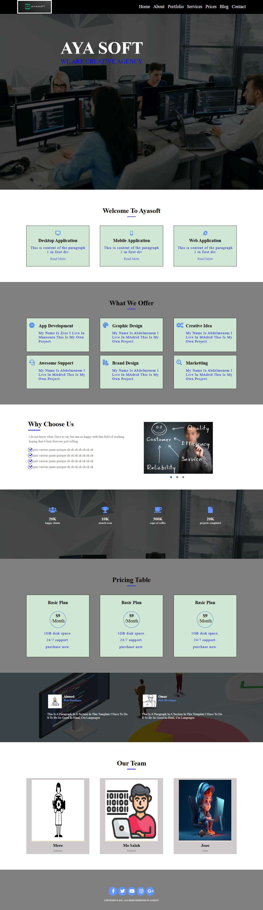

# Abdo Site 1 - Basic HTML Website

This repository contains the code for **AyA SOFT**, a simple, static HTML website created to demonstrate foundational web development skills. The project is designed with a clean layout, ideal for introducing core HTML structure and tags.

 

## 🌐 Live Demo

Explore the live demo [here](https://abdo-fullstack-projects-2023.github.io/abdo-site1-html/).

## 📋 Features

- **Simple HTML Structure**: Demonstrates the basics of HTML, including headings, paragraphs, lists, and links.
- **Accessible Layout**: Clean, organized structure for easy readability and navigation.
- **Beginner-Friendly**: Suitable as a reference for beginners learning HTML essentials.

## 🛠️ Technologies Used

- **HTML5**

## 📂 Project Structure

```plaintext
├── index.html         # Main HTML file
├── images/            # Image assets for the website (if any)
└── README.md          # Project documentation
